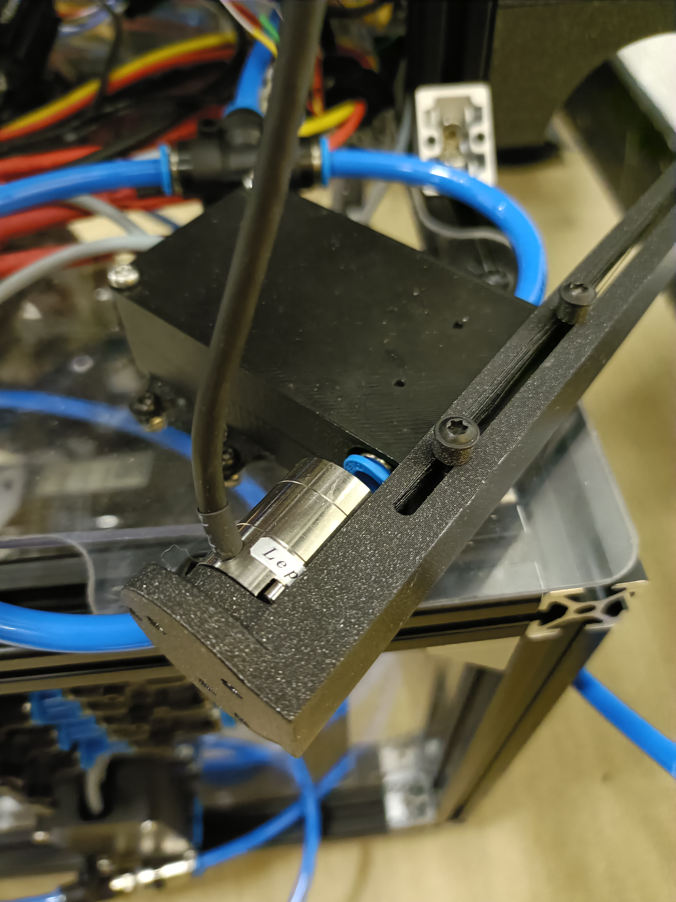

# Evaluation

## Measure thruster force

### Attach force sensor

Attach the force sensor like the following image. THE CABLE IS FRAGILE, WATCH OUT.



### Launch Leptrino

Launch ros2 node following [leptrino_force_torque](https://github.com/aky-u/leptrino_force_torque/tree/ros2_control) for the detail.

### Play & Record

Visualize the force by, 

```bash
ros2 run plotjuggler plotjuggler
```

Record the data by,

```bash
ros2 bag record -a
```